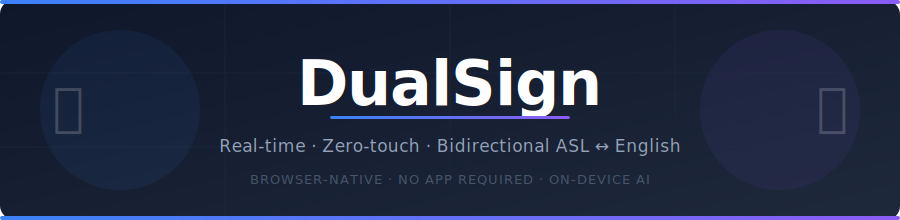

<p align="center">
  
</p>

---

## About the Project

DualSign eliminates communication friction between Deaf and hearing people without requiring anyone to install an app or hand over their device.

The system uses a **dual-screen architecture**:

- **Host (Deaf user)** — opens `/host` on their own device. The browser captures the webcam, runs on-device AI to recognise ASL signs, and generates a shareable QR code.
- **Listener (hearing user)** — scans the QR code to open `/guest` on their own phone. They read the translated message, hear it spoken aloud, and can reply with their voice.

A lightweight Node.js server acts as the relay, routing messages between the two browsers in real time over WebSockets.

---

## How it Works (Under the Hood)

1. **Landmark extraction** — MediaPipe Holistic runs inside the browser and samples 1,629 body/face/hand coordinate values (pose + face mesh + both hands) from every webcam frame.

2. **Sign recognition** — A 30-frame sliding window is fed into a custom LSTM neural network exported to TF.js. The model was trained on the WLASL dataset and achieves 82.3% accuracy across 10 core ASL words. All inference happens on the user's device; no video is ever sent to the server.

3. **Natural language enrichment** — The raw gloss sequence (e.g. `["WATER", "PLEASE"]`) is sent to the Groq NLP API and rewritten as conversational English (`"Could I have some water, please?"`), then read aloud to the listener via ElevenLabs TTS.

4. **Voice reply** — The listener speaks back; the browser records the audio, sends it to the server, and Groq Whisper transcribes it. The Host sees the reply as text with sentiment context — no camera, no signing, no typing required on the listener's side.

---

## Core Gestures

The Host controls the entire session **without touching the screen**:

| Gesture | Action |
|---|---|
| Raise both hands above shoulder level | Activate live detection (enters REC mode) |
| Lower hands briefly, then raise again | Confirm the current sign and add it to the phrase |
| Hold both hands down for ~2 seconds | Send the complete phrase to the listener |

A progress bar on the host screen shows lowering progress and marks the word-separator threshold.

---

## Getting Started

**Prerequisites:** Node.js ≥ 18, npm ≥ 9

### 1 — Clone the repository

```bash
git clone <repo-url>
cd asl-translator-monorepo
```

### 2 — Configure environment variables

Create `backend-sockets/.env`:

```env
GROQ_API_KEY=your_groq_key
ELEVENLABS_API_KEY=your_elevenlabs_key
ELEVENLABS_VOICE_ID=your_voice_id
```

`PORT` (default `3000`) and `CLIENT_URL` (default `http://localhost:5173`) can also be overridden here.

### 3 — Start the backend

```bash
cd backend-sockets
npm install
npm run dev        # http://localhost:3000
```

### 4 — Start the frontend

```bash
cd web-frontend
npm install
npm run dev        # http://localhost:5173
```

Open **`http://localhost:5173/host`** on the signing device and **`http://localhost:5173/guest?room=<id>`** (or scan the QR) on the listener's phone.

> **LAN / mobile testing** — run `npm run dev:lan` in the backend to find your network address, then add `VITE_PUBLIC_URL=https://<your-lan-ip>:5173` to `web-frontend/.env.local`.

---

## ML Pipeline (optional)

The pre-trained model is already included in `web-frontend/public/models/`. Re-run the pipeline only if you want to add new signs or retrain from scratch.

**Prerequisites:** Python 3.10

```bash
cd ml
python3.10 -m venv venv
source venv/bin/activate        # Windows: venv\Scripts\activate
pip install -r requirements.txt
```

Run the steps in order:

```bash
python scripts/1_filter_dataset.py    # filter WLASL dataset to target word classes
python scripts/extract_features.py    # extract MediaPipe landmarks → .npy files
python scripts/train_model.py         # train LSTM → artifacts/modelo_dualsign.keras
python scripts/export_tfjs.py         # convert and copy to web-frontend/public/models/
```

The raw video dataset (WLASL) is not included in the repository. Download it separately and place it under `ml/data/source/` before running the first script.

### Training Dashboard

All training results — accuracy curves, loss evolution, confusion matrix, and per-class confidence distribution — are available as an interactive Streamlit dashboard.

```bash
cd ml
source venv/bin/activate
streamlit run scripts/dashboard.py    # opens http://localhost:8501
```

The dashboard reads pre-computed JSON files from `ml/artifacts/dashboard_data/`, so no model or GPU is needed to view it. The data from the last training run is already included in the repository.

---

## Architecture

```
asl-translator-monorepo/
├── backend-sockets/   Node.js + Socket.io relay server (Clean Architecture)
├── web-frontend/      React 19 + Vite + TailwindCSS 4 — host & guest UIs
└── ml/                Python 3.10 training pipeline (TensorFlow + MediaPipe)
```
