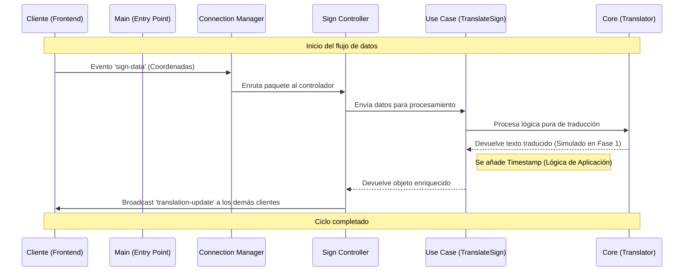

# 📄 Reporte Técnico de Arquitectura: ASL Real-Time Backend

> 🚧 **ESTADO DEL PROYECTO: Fase 1 (Fundamentos y Arquitectura)**
> *Nota: Este documento describe exclusivamente la fase de desarrollo en la que nos encontramos en este momento. Hemos completado la refactorización estructural hacia una Clean Architecture. Las siguientes fases (Integración con Frontend, IA y Persistencia de datos) están en el roadmap.*

Este documento describe la arquitectura, el flujo de datos y la lógica de negocio base del servidor de traducción de Lenguaje de Señas Americano (ASL). El sistema ha sido diseñado bajo los principios de **Clean Architecture** (Arquitectura de Cebolla) para garantizar un desacoplamiento total entre la tecnología de red y la lógica de dominio.

---

## 1. Resumen Ejecutivo del Backend

La solución implementada en esta fase inicial consiste en un motor de procesamiento en tiempo real basado en eventos. Su lógica de negocio principal es la **orquestación y traducción de flujos de datos biométricos** (coordenadas de manos) provenientes de un cliente frontend.

A diferencia de las APIs REST tradicionales, este backend utiliza **WebSockets** para permitir una comunicación bidireccional de baja latencia. La arquitectura está preparada para escalar desde una simple simulación (nuestro estado actual) hasta la integración con modelos complejos de Inteligencia Artificial sin necesidad de modificar la infraestructura de red, gracias a la separación estricta de responsabilidades.

---

## 2. Desglose de Arquitectura y Módulos

El proyecto se organiza en una jerarquía de capas donde las dependencias solo apuntan hacia el centro (el dominio).

### Jerarquía de Carpetas
```text
src/
├── asl-core/           # Capa de Dominio (Corazón del sistema)
├── application/        # Capa de Aplicación (Casos de Uso)
├── infrastructure/     # Capa de Infraestructura (Adaptadores y Drivers)
└── entry-points/       # Punto de entrada (Arranque)
```

### Utilidad de los Módulos
* **`asl-core` (Dominio):** Contiene la lógica pura de traducción. No conoce la existencia de Internet, Sockets o Bases de Datos. Su única misión es transformar coordenadas en texto. Esta separación permite testear la lógica matemática de forma aislada.
* **`application` (Casos de Uso):** Actúa como el "Jefe de Cocina". Define qué debe pasar en la aplicación (ej. "Traducir una seña y ponerle sello de tiempo"). Orquesta el flujo entre el mundo exterior y el core.
* **`infrastructure` (Infraestructura):** Aquí residen los detalles técnicos. El servidor Socket.io, los controladores de red y el gestor de conexiones. Si mañana cambiamos WebSockets por otra tecnología, solo se vería afectada esta carpeta.
* **`entry-points`:** Es el cableado inicial. Configura el servidor Express, los middlewares de seguridad (CORS) y enciende los motores del sistema.

---

## 3. Diagrama de Flujo del Ciclo de Vida

El siguiente diagrama representa el recorrido de una trama de datos desde que el usuario realiza una seña hasta que la traducción es distribuida a los observadores:



---

## 4. Justificación de Componentes Clave

Para lograr un sistema robusto, se programaron componentes con roles críticos específicos:

### `setupConnectionManager` (Infrastructure/Manager)
Su rol es el **Control de Ciclo de Vida**. Es el único componente que sabe cuándo un usuario se conecta o desconecta. Actúa como el "Portero", asegurando que cada socket reciba sus escuchas de eventos correspondientes sin mezclar estados entre usuarios.

### `handleSignData` (Infrastructure/Controller)
Implementa un patrón de **Currying** para la inyección del socket. Su importancia radica en el desacoplamiento: permite que el controlador maneje la estrategia de red (decidir si enviar un error privado o un éxito público vía `broadcast`) sin que la lógica de traducción sepa cómo funciona la red.

### `executeTranslateSign` (Application/UseCase)
Es el **Orquestador de Metadatos**. Su rol crítico es asegurar que la respuesta del sistema cumpla con los requisitos de la aplicación (en este caso, inyectar un `timestamp` ISO). Garantiza que el Core se mantenga "limpio" de datos que no son de traducción pura.

### `processSignData` (Core/Domain)
Es la **Garantía de Integridad**. Antes de intentar cualquier traducción, valida que los datos no sean nulos o corruptos. Es el componente más estable del sistema; su éxito se mide en su capacidad de devolver siempre un objeto con un `status` predecible, independientemente de la entrada.

---

**Nota Técnica:** Este backend utiliza una estrategia de logs cromáticos (`chalk`) para permitir una auditoría visual inmediata del flujo de datos a través de las capas mencionadas en este reporte.
```